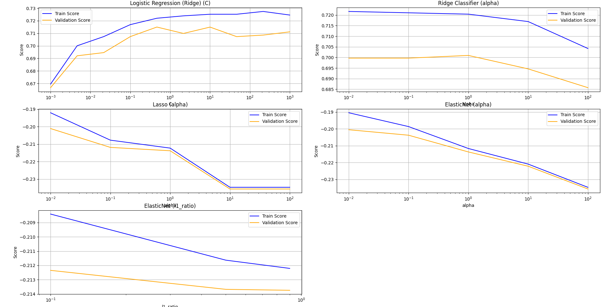

<h1>Лабораторна робота № 2</h1>
<h2>Лінійні моделі машинного навчання</h2>
<ul><h3>Постановка задачі</h3>
    <li>Для коду:
        <ul>
            <li>створити окрему директорію з номером роботи (LW1)</li>
            <li>всі додаткові матеріали, котрі стосуються цієї роботи, мають бути розміщені в ній.</li> 
        </ul>
    </li>
<li>Ознайомитись з описом датасета, визначити цільову змінну (target) та основну задачу прогнозної моделі. </li>
<li>Виконати попередню обробку даних з метою подальшої побудови моделі. Можна використовувати ту інформацію, котру ви отримали в результаті виконання завдань Лабораторної роботи №1.</li>
<li>Побудувати одну з лінійних моделей машинного навчання (лінійну регресію або логістичну регресію, залежно від вашого варіанту). Оцінити якість моделі на тестових даних за допомогою декількох метрик. Зробити висновки. (3 бали)</li>
<li>Застосувати декілька типів регуляризації (Ridge, Lasso, ElasticNet), налаштувати гіперпараметри моделей, побудувати валідаційні криві (залежність результуючої метрики від гіперпараметрів). Оцінити якість отриманих моделей, порівняти між собою. Зробити висновки. (5 балів)</li>
<li>Вивести (або візуалізувати) коефіцієнти найкращої з отриманих моделей, зробити висновок щодо впливовості факторів на результуючу змінну (target). (2 бали)</li>
</ul>

<h3>Отримані висновки в результаті виконання коду</h3>

* Дані пов'язані з прямими маркетинговими кампаніями португальської банківської установи. Маркетингові кампанії базувалися на телефонних дзвінках. Часто було потрібно більше одного контакту з одним і тим же клієнтом, щоб дізнатися, чи буде він підписаний на продукт (банківський строковий депозит) («так»), чи ні («ні»). Target: y - чи оформив клієнт строковий депозит (бінарний: «так», «ні»)

<ul> Попередня обробка даних:
    <li>Обробка відсутніх значень: Замінюю невідомі значення на NaN та видаляю рядки з пропущеними даними.</li>
    <li>Обробка дублікатних знаяень: При наявності дублікатних рядків - видаляю один з них.</li>
    <li>Масштабування та кодування: Використовую StandardScaler для масштабування кількісних змінних і LabelEncoder для кодування категоріальних змінних, що є стандартною практикою перед побудовою моделей.</li>
    <li>Розбиття даних: Дані розбиваю на Training, Validation й Test sets, що дає змогу коректно оцінити якість моделі на різних етапах.</li>
    <li>Навчання моделі: У функції train_and_evaluate_model використовую тренування моделей (наприклад, Logistic Regression або RidgeClassifier).</li>
</ul>

<ul> Логістична регресія:
    <li> Test set:
        <ul>
            <li>Accuracy: 0.69</li>
            <li>Precision: 0.73</li>
            <li>Recall: 0.86</li>
            <li>F1: 0.79</li>
            <li>Roc_auc: 0.62</li>
            <li>Confusion Matrix: [[ 33 56][ 24 149]]</li>
        </ul>
    </li>
    <li>Dev set:
        <ul>
            <li>Accuracy: 0.75</li>
            <li>Precision: 0.80</li>
            <li>Recall: 0.84</li>
            <li>F1: 0.82</li>
            <li>Roc_auc: 0.70</li>
            <li>Confusion Matrix:[[ 49  37][ 29 147]]</li>
        </ul>
    </li>
</ul>

<ul> Ridge Classifier:
    <li> Test set:
        <ul>
            <li>Accuracy: 0.69</li>
            <li>Precision: 0.73</li>
            <li>Recall: 0.84</li>
            <li>F1: 0.78</li>
            <li>Roc_auc: 0.61</li>
            <li>Confusion Matrix:[[ 34  55][ 27 146]]</li>
        </ul>
    </li>
    <li>Dev set:
        <ul>
            <li>Accuracy: 0.74</li>
            <li>Precision: 0.78</li>
            <li>Recall: 0.86</li>
            <li>F1: 0.82</li>
            <li>Roc_auc: 0.68</li>
            <li>Confusion Matrix:[[ 44  42][ 25 151]]</li>
        </ul>
    </li>
</ul>

Висновок: Маємо мінімальні ознаки overfitting і стабільне узагальнення даних.

<ul>Lasso Classifier:
    <li>Test set:
        <ul>
            <li>Mean squared error : 0.20</li>
        </ul>
    </li>
    <li>Dev set:
        <ul>
            <li>Mean squared error: 0.18</li>
        </ul>
    </li>
</ul>
<ul>ElasticNet Classifier:
    <li>Test set:
        <ul>
            <li>Mean squared error : 0.20</li>
        </ul>
    </li>
     <li>Dev set:
        <ul>
            <li>Mean squared error: 0.18</li>
        </ul>
    </li>
</ul>

<>Висновок: Обидві моделі (Lasso та ElasticNet) продемонстрували стабільність та відсутність перенавчання.

<h4>Висновки:</h4> 
<li>Логістична регресія (Ridge) та Ridge Classifier працюють однаково як на Test, так і на Dev наборах.</li>
<li>Невелике падіння accuracy, precision, recall, та F1 scores при переході від Dev вибірки до Test в логістичній регресії (Ridge) та класифікаторі Ridge вказує на незначне Overfitting, але загалом на хорошу узагальненість моделі.</li>
<li>Однакові значення MSE між набором  Dev та Test для Lasso та ElasticNet свідчать про стабільну роботу моделі.</li>

<h3>Аналітика візуалізації</h3>

<ul>
    <li><ul>Logistic Regression (Ridge) (C):
        <li>У разі збільшення параметра C (зменшення регуляризації) спостерігається зростання точності як для Training, так і для Validation Score. За надто великих значень C спостерігається невелике зниження точності під час перевірки, що вказує на можливе Overfitting. Тобто варто зазначити, що оптимальні результати досягаються при помірних значеннях C (близько 1 або трішки більше).</li></ul>
    </li>
    <li><ul>Ridge Classifier
        <li>Із збільшенням значення параметра alpha (посилення регуляризації), точність поступово знижується. Це видно на обох кривих. Отже можемо сказати, що модель має стабільну поведінку при малих значеннях alpha, але занадто велика регуляризація (велике alpha) призводить до Underfitting</li></ul>
    </li>
    <li><ul>Lasso (alpha):
        <li>Training score різко знижується при збільшенні alpha, що означає значну регуляризацію. Validation score знижується трохи м'якше. Тобто, Lasso занадто агресивно зменшує коефіцієнти, що може призвести до втрати інформації. Малі значення alpha(приблизно 0.1–1) є оптимальними.</li></ul>
    </li>
    <li><ul>ElasticNet (alpha):
        <li>І Training, і Validation Score криві знижуються зі збільшення alpha. Це вказує на те, що сильна регуляризація погіршує продуктивність. Тому можемо сказати, що краще використовувати малі значення alpha, інакше модель Underfitiing</li>
        </ul>
    </li>
    <li><ul>ElasticNet (параметр l1_ratio):
        <li>Із збільшенням частки l1-регуляризації модель втрачає точність. Але зміна незначна і це показуж, що модель стійка до зміни параметра.
Висновок: оптимальний l1_ratio має бути ближче до нуля (що означає більше l2-регуляризації).</li> </ul>
</ul>

